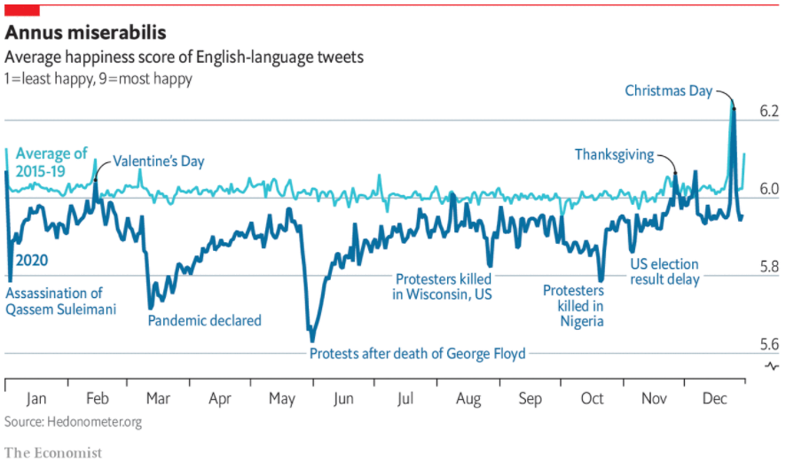

```{r setup, include=FALSE}
# chunk options
options(scipen = 123)
knitr::opts_chunk$set(
  message = FALSE,
  warning = FALSE,
  fig.align = "center",
  comment = "#>",
  fig.width=10,
  fig.height=6
)
```

Welcome to the Rplicate Series! In this article we will try to replicate the plot from The Economist article, [Twitter users have had their most miserable year yet](https://www.economist.com/graphic-detail/2020/12/31/twitter-users-have-had-their-most-miserable-year-yet). This article will cover how to change the value of axes, making arrow to highlight information on our plot, and set multiple row on our title. 

```{r, out.width = "800px"}

```

# Load Packages
Below is the required packages for data wrangling and visualization.
```{r}
library(httr) # get data from API
library(jsonlite) # prepare the data from json format
library(tidyverse) # data wrangling
library(lubridate) # processing date format
library(padr) # make padding on the missing date value
library(zoo) # fill the value
library(ggplot2) # data visualization
library(scales) # setting axis label options
theme_set(theme_minimal())
```

# Data Collection
The dataset was taken from [hedonometer.org](https://hedonometer.org/timeseries/en_all/?from=2015-01-01&to=2020-12-31) API. We will need to GET the data and convert it from json format to dataframe.
```{r}
# get the data
uri <- GET('http://hedonometer.org/api/v1/happiness/?format=json&timeseries__title=en_all&date__gte=2015-01-01&limit=2188')
data <-  fromJSON(rawToChar(uri$content))$objects
names(data)
head(data)
```

Since the data is in static condition, it is better for us to save the dataframe into csv format and then read it in the future directly from this file. We will also arrange the data first since it comes with the data sorted by their happiness index.
```{r}
# sort the data based on date
dataset <- data %>%
  mutate(date = ymd(date)) %>%
  arrange(date)

# saving to csv
write.csv(dataset, "C:/Users/ALGORITMA/Documents/DSS/DSS 4/data_input/dataset.csv")

# read directly from csv 
df <- read.csv('data_input/dataset.csv')
head(df)
```

# Data wrangling
The visualization later will only use 2 of our columns so we will filter other column here. Also, since we read the dataset from csv, we need to change the type of our date type again.
```{r}
df <- df %>% 
  mutate(date = ymd(date)) %>% 
  select(-c(timeseries, frequency, X))
head(df)
```

The Annus miserabillis plot consist of two line chart. The first one is a chart of happiness index average from 2015 to 2019, while the second one is a chart of happiness index from 2020. The part below is to make a dataframe for the first chart. We need to filter the data then make a group by based on month and day. On this part last step, we will insert date of 2020 to this dataframe for easier visualization later.
```{r}
df1519 <- df %>%
  filter(date < "2020-01-01") %>%
  mutate(month = month(date),
         day = day(date)) %>% 
  group_by(month, day) %>% 
  summarise(
    happiness = mean(happiness)
  ) %>% 
  ungroup() %>% 
  mutate(date = seq(from = ymd("2020-01-01"), to = ymd("2020-12-31"), by="day"))

tail(df1519)
```

This part is to make a dataframe for the second chart which is 2020 happiness index. The step is simpler than the one before. The process only padding and try to fill if there is missing values on our data.
```{r}
df20 <- df %>%
  filter(date > "2019-12-31") %>%
  pad() %>% 
  mutate(happiness = na.fill(happiness, fill = "extend"))

head(df20)
```

# Visualization
The data is ready, so we are going to make the visualization now. We will use `df20` as our base plot. It doesn't matter what data we use on our base plot since the total row are the same, also we already set the date of our `df1519` data to 2020 date. 
```{r}
p1 <- ggplot(df20, aes(x=date, y=happiness)) +
  geom_line(data = df1519, aes(x=date, y=happiness), 
            size = 1.75, color = '#31c0d3') + # plot average year 2015-2019
  geom_line(size = 1.75, color = '#076fa1')   # plot year 2020

p1
```

The second visualization part will be adding label to our line chart. We will named them like the real plot here.
```{r}
p2 <- p1 + 
  geom_text(data = df20[4,],
            label = "Average of\n2015-19",
            color = '#31c0d3', nudge_y = 0.22, 
            hjust = "left", size = 4.5,  fontface = "bold") +
  geom_text(data = df20[4,],
            aes(label = "2020"),
            color = '#076fa1', nudge_y = -0.05, nudge_x = 2,
            hjust = "left", size = 4.5, fontface = "bold")

p2
```

Third part will be adding events from 2020 to highlight some spikes on our chart.
```{r}
p3 <- p2 +
  geom_text(data = df20[df20$date == '2020-01-03',],
            label = "Assassination of\nQassem Suleimani",
            color = '#076fa1', nudge_y = -0.05, nudge_x = -2,
            hjust = "left", size = 4.5, lineheight = 0.9) +
  geom_text(data = df20[df20$date == '2020-02-14',],
            label = "Valentine's Day",
            color = '#076fa1', nudge_y = 0.07, nudge_x = 10,
            hjust = "left", size = 4.5) +
  geom_text(data = df20[df20$date == '2020-03-11',],
            aes(label = "Pandemic declared"),
            color = '#076fa1', nudge_y = -0.1,
            hjust = "left", size = 4.5) + 
  geom_text(data = df20[df20$date == '2020-05-26',],
            aes(label = "Protests after death of George Floyd"),
            color = '#076fa1', nudge_y = -0.24, nudge_x = 2,
            hjust = "left", size = 4.5) +
  geom_text(data = df20[df20$date == '2020-08-25',],
            aes(label = "Protesters killed\nin Wisconsin, US"),
            color = '#076fa1', nudge_y = -0.12, nudge_x = 2,
            hjust = "right", size = 4.5, lineheight = 0.9) +
  geom_text(data = df20[df20$date == '2020-10-20',],
            aes(label = "Protesters\nkilled in\nNigeria"),
            color = '#076fa1', nudge_y = -0.09, nudge_x = 2,
            hjust = "right", size = 4.5, lineheight = 0.9) +
  geom_text(data = df20[df20$date == '2020-11-06',],
            aes(label = "US selection\nresult delay"),
            color = '#076fa1', nudge_y = -0.08, nudge_x = -3,
            hjust = "left", size = 4.5, lineheight = 0.9) +
  geom_text(data = df20[df20$date == '2020-11-26',],
            aes(label = "Thanksgiving"),
            color = '#076fa1', nudge_y = 0.076, nudge_x = -10,
            hjust = "right", size = 4.5) +
  geom_text(data = df20[df20$date == '2020-12-25',],
            aes(label = "Christmas Day"),
            color = '#076fa1', nudge_y = 0.05, nudge_x = -10,
            hjust = "right", size = 4.5)

p3
```

Some of the event text above are floating and need some arrow to highlight the exact time so we add curve arrow here and there.
```{r}
p4 <- p3 +
  geom_curve(aes(x = df20[df20$date == '2020-02-14',]$date + 8, 
                 y = df20[df20$date == '2020-02-14',]$happiness + 0.06,
                 xend = df20[df20$date == '2020-02-14',]$date, 
                 yend = df20[df20$date == '2020-02-14',]$happiness + 0.005),
             data = df20,
             arrow = arrow(length = unit(0.015, "npc")),
             curvature = 0.5) +
  geom_curve(aes(x = df20[df20$date == '2020-11-26',]$date - 8, 
                 y = df20[df20$date == '2020-11-26',]$happiness + 0.07,
                 xend = df20[df20$date == '2020-11-27',]$date, 
                 yend = df20[df20$date == '2020-11-27',]$happiness + 0.005),
             data = df20,
             arrow = arrow(length = unit(0.015, "npc")),
             curvature = -0.5) +
  geom_curve(aes(x = df20[df20$date == '2020-12-25',]$date - 9, 
                 y = df20[df20$date == '2020-12-25',]$happiness + 0.05,
                 xend = df20[df20$date == '2020-12-25',]$date, 
                 yend = df20[df20$date == '2020-12-25',]$happiness + 0.005),
             data = df20,
             arrow = arrow(length = unit(0.015, "npc")),
             curvature = -0.5)

p4
```

The content of the chart is done, but the anatomy of our graph is not done yet. We will set the x and y axis here. For the y axis, we will move it to the right side and set the limit to 5.5 - 6.3. While the y axis need another treatment, we set the break for each ticks to be 1 month and show only abbreviation of the month name on the label.
```{r}
p5 <- p4 +
  scale_y_continuous(position = "right", limits = c(5.5, 6.3)) +
  scale_x_date(date_labels = "%b", date_breaks = "1 month")

p5
```

Here we will add title, subtitle, and caption on our plot.
```{r}
p6 <- p5 +
  labs(x = "", y = "",
       title = expression(atop(bold("Annus miserabilis                            "),
                               atop("Average happiness score of English-language tweets", ""))),
       subtitle = "1=least happy, 9=most happy",
       caption = "Source: Hedonometer.org")
p6
```

The last part will be setting theme of our plot, which is separated to three major component. First one will be setting major and minor grid, we will only use major y grid, the second is setting axis line, ticks, and text part, and the last part is setting title, caption, and subtitle text options.
That will conclude the Annus miserabillis final plot using ggplot2!
```{r}
p7 <- p6 +
  theme(text = element_text(family = "Calibri"), 
        panel.grid.minor = element_blank(),
        panel.grid.major.y = element_line(color = "#dbe2e7", size = 0.5),
        panel.grid.major.x = element_blank(),
        
        axis.text.x = element_text(size=15), 
        axis.text.y = element_text(size=15),
        axis.line.x = element_line(color = "black", size = 0.5),
        axis.ticks.x = element_line(size = 1),
        axis.ticks.length.x = unit(5, "pt"),
        
        plot.title = element_text(margin=margin(b=0), size = 20, face = "bold"),
        plot.caption = element_text(color = "#899499", hjust = 0, size = 12),
        plot.subtitle = element_text(size = 15, color = "#899499", vjust = 5)) 
  
p7
```

<div class="tocify-extend-page" data-unique="tocify-extend-page" style="height: 0;"></div>
