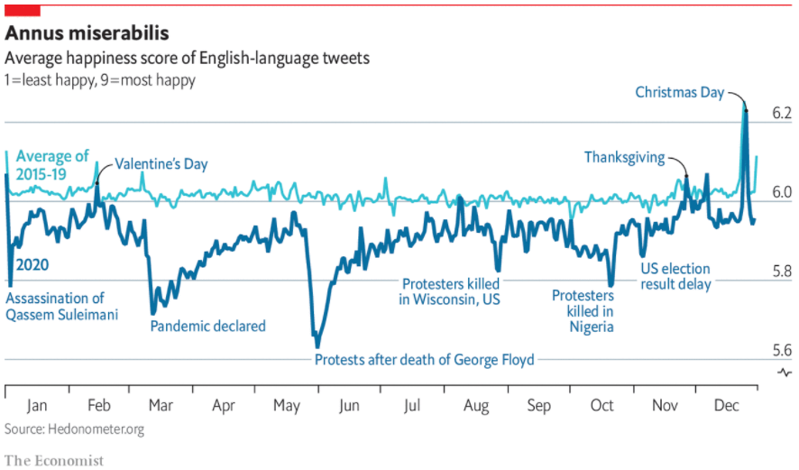

```{r setup, include=FALSE}
knitr::opts_chunk$set(echo = TRUE)
```

# Load library
```{r}
library(httr)
library(jsonlite)
library(tidyverse)
library(lubridate)
library(dplyr)
library(padr)
library(zoo)
```

```{r}
# # taking data from API
# uri <- GET('http://hedonometer.org/api/v1/happiness/?format=json&timeseries__title=en_all&date__gte=2015-01-01&limit=2188')
# data <-  fromJSON(rawToChar(uri$content))$objects
# 
# # sort the data based on date
# dataset <- data %>% 
#   mutate(date = ymd(date)) %>% 
#   arrange(date)
# 
# # saving to csv
# write.csv(dataset, "C:/Users/ALGORITMA/Documents/DSS/DSS 4/data_input/dataset.csv")
# 
# # inspect 
# # names(data)
# # tail(dataset)
```

real plot from the economist
```{r echo=FALSE}

```


read dataset from csv
```{r}
df <- read.csv('data_input/dataset.csv')
head(df)
```

```{r}
df <- df %>% 
  mutate(date = ymd(date)) %>% 
  select(-timeseries)
```

make dataframe of happiness value average from 2015 - 2019
```{r}
df1519 <- df %>%
  filter(date < "2020-01-01") %>%
  mutate(month = month(date),
         day = day(date),
         monthday = paste(month, day, sep = "-")) %>% 
  group_by(monthday) %>% 
  summarise(
    happiness = mean(happiness)
  ) %>% 
  ungroup() %>% 
  mutate(date = seq(from = ymd("2020-01-01"), to = ymd("2020-12-31"), by="day"))
tail(df1519)
```

make dataframe of 2020 happines value
```{r}
df20 <- df %>%
  filter(date > "2019-12-31") %>%
  pad() %>% 
  mutate(happiness = na.fill(happiness, fill = "extend"),
         month = month(date),
         day = day(date),
         monthday = paste(month, day, sep = "-")) %>% 
  select(-c(month, day, frequency, X))
head(df20)
```
check missing value
```{r}
colSums(is.na(df1519))
colSums(is.na(df20))
```

make base plot
```{r}
plot <- ggplot(df20, aes(x=date, y=happiness)) +
  geom_line() + 
  geom_line(data = df1519, aes(x=date, y=happiness))
plot
```

